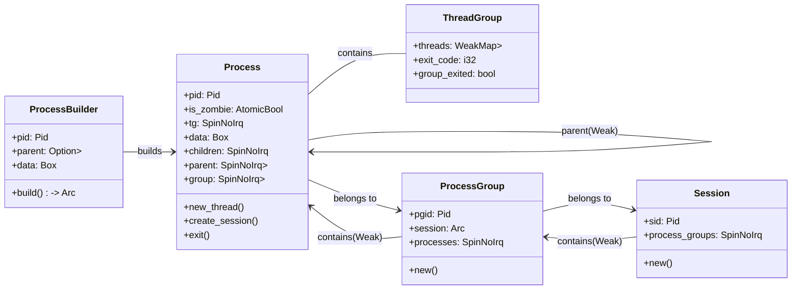

# StarryX-Record

启动流程 _start(axhal) -> rust_entry(axhal) -> rust_main(axruntime) -> main(starry) -> run_user_app


run_user_app major process
1. 进入执行程序目录
2. 加载用户elf文件
3. 初始化用户上下文
4. 创建用户任务和线程数据
5. 复制全局命名空间数据到本地线程空间
6. 创建进程和线程
7. 阻塞主任务并调度


## 进程管理

```rust
axprocess::Process::new_init(axtask::current().id().as_u64() as _).build();
```

相关数据结构

```rust
/// A builder for creating a new [`Process`].
pub struct ProcessBuilder {
    pid: Pid,
    parent: Option<Arc<Process>>,
    data: Box<dyn Any + Send + Sync>,
}

/// A process.
pub struct Process {
    pid: Pid,
    is_zombie: AtomicBool,
    pub(crate) tg: SpinNoIrq<ThreadGroup>,

    data: Box<dyn Any + Send + Sync>,

    // TODO: child subreaper
    children: SpinNoIrq<StrongMap<Pid, Arc<Process>>>,
    parent: SpinNoIrq<Weak<Process>>,

    group: SpinNoIrq<Arc<ProcessGroup>>,
}

pub(crate) struct ThreadGroup {
    pub(crate) threads: WeakMap<Pid, Weak<Thread>>,
    pub(crate) exit_code: i32,
    pub(crate) group_exited: bool,
}

/// A [`ProcessGroup`] is a collection of [`Process`]es.
pub struct ProcessGroup {
    pgid: Pid,
    pub(crate) session: Arc<Session>,
    pub(crate) processes: SpinNoIrq<WeakMap<Pid, Weak<Process>>>,
}

/// A [`Session`] is a collection of [`ProcessGroup`]s.
pub struct Session {
    sid: Pid,
    pub(crate) process_groups: SpinNoIrq<WeakMap<Pid, Weak<ProcessGroup>>>,
    // TODO: shell job control
}
```



