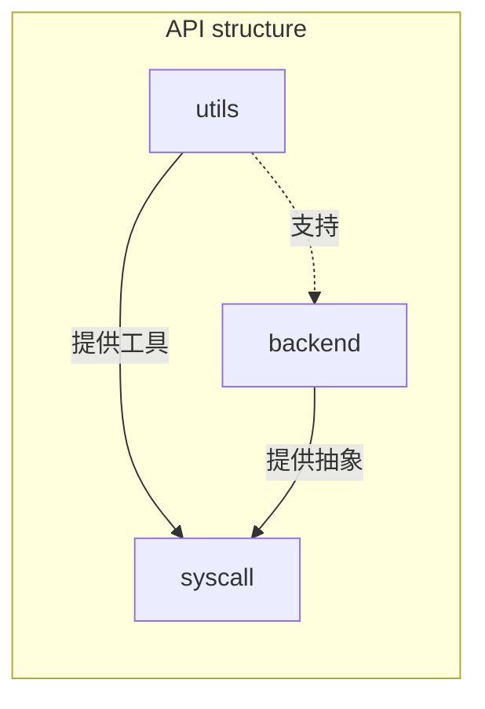
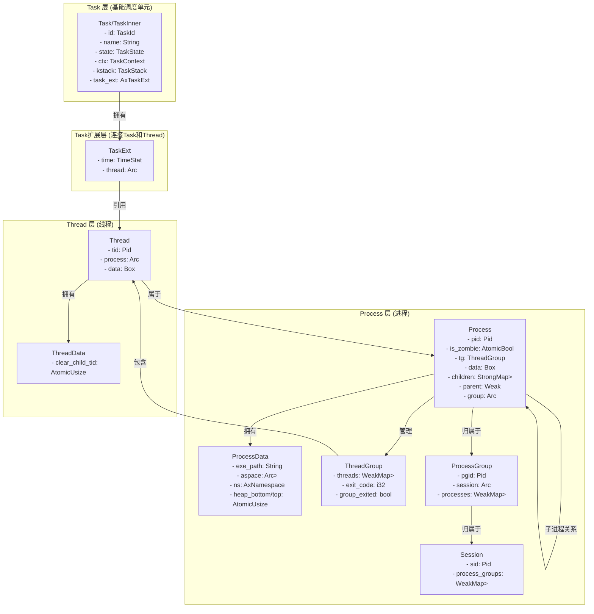

# Todo

## 5.18

- add docs

- testcode (fix libctest -> busybox test)
  - busybox (poll select related io mpx..)
  - libctest (socket pthread_cancel_points pthread_robust_detach)
  - Fix the error of tls_get_new_dtv in multi-core scenario (libctest) (futex? or membarriar?)
- share memory/cow related system features (future)

## 5.12

- refactor,replace current project with a more clear and hierarchical structure(src—core—module—api)

- more syscall
- share memory/cow related system features
- fix the file stat wrong implementation

# StarryX-Record

启动流程 _start(axhal) -> rust_entry(axhal) -> rust_main(axruntime) -> main(starry) -> run_user_app


run_user_app major process
1. 进入执行程序目录
2. 加载用户elf文件
3. 初始化用户上下文
4. 创建用户任务和线程数据
5. 复制全局命名空间数据到本地线程空间
6. 创建进程和线程
7. 阻塞主任务并调度

## Structure




api部分重构为utils，backend，syscall三个部分，utils为syscall提供的“工具”，所有syscall均可复用比如ptr；backend为syscall的后端实现，提供可被复用的抽象trait,datastrucre and functions,可被同一模块的多个syscall复用

## 进程管理

### 数据结构




```rust
axprocess::Process::new_init(axtask::current().id().as_u64() as _).build();
```

相关数据结构

```rust
/// A builder for creating a new [`Process`].
pub struct ProcessBuilder {
    pid: Pid,
    parent: Option<Arc<Process>>,
    data: Box<dyn Any + Send + Sync>,
}

/// A process.
pub struct Process {
    pid: Pid,
    is_zombie: AtomicBool,
    pub(crate) tg: SpinNoIrq<ThreadGroup>,

    data: Box<dyn Any + Send + Sync>,

    // TODO: child subreaper
    children: SpinNoIrq<StrongMap<Pid, Arc<Process>>>,
    parent: SpinNoIrq<Weak<Process>>,

    group: SpinNoIrq<Arc<ProcessGroup>>,
}

pub(crate) struct ThreadGroup {
    pub(crate) threads: WeakMap<Pid, Weak<Thread>>,
    pub(crate) exit_code: i32,
    pub(crate) group_exited: bool,
}

/// A [`ProcessGroup`] is a collection of [`Process`]es.
pub struct ProcessGroup {
    pgid: Pid,
    pub(crate) session: Arc<Session>,
    pub(crate) processes: SpinNoIrq<WeakMap<Pid, Weak<Process>>>,
}

/// A [`Session`] is a collection of [`ProcessGroup`]s.
pub struct Session {
    sid: Pid,
    pub(crate) process_groups: SpinNoIrq<WeakMap<Pid, Weak<ProcessGroup>>>,
    // TODO: shell job control
}
```

### 资源限制

## 信号机制

````mermaid
classDiagram
    class Signo {
        +SIGHUP, SIGINT, SIGKILL, etc.
        +is_realtime() bool
        +default_action() DefaultSignalAction
    }
    
    class DefaultSignalAction {
        <<enumeration>>
        Terminate
        Ignore
        CoreDump
        Stop
        Continue
    }
    
    class SignalOSAction {
        <<enumeration>>
        Terminate
        CoreDump
        Stop
        Continue
        Handler
    }
    
    class SignalSet {
        -u64 value
        +add(signal: Signo) bool
        +remove(signal: Signo) bool
        +has(signal: Signo) bool
        +dequeue(mask: SignalSet) Option~Signo~
        +to_ctype(dest: kernel_sigset_t)
    }
    
    class SignalInfo {
        -siginfo_t raw_info
        +new(signo: Signo, code: u32)
        +signo() Signo
        +set_signo(signo: Signo)
        +code() u32
        +set_code(code: u32)
    }
    
    class SignalActionFlags {
        <<bitflags>>
        +SIGINFO
        +NODEFER
        +RESETHAND
        +RESTART
        +ONSTACK
        +RESTORER
    }
    
    class SignalDisposition {
        <<enumeration>>
        Default
        Ignore
        Handler
    }
    
    class SignalAction {
        +flags: SignalActionFlags
        +mask: SignalSet
        +disposition: SignalDisposition
        +restorer: __sigrestore_t
        +to_ctype(dest: kernel_sigaction)
    }
    
    class SignalStack {
        +sp: usize
        +flags: u32
        +size: usize
        +disabled() bool
    }
    
    class PendingSignals {
        +set: SignalSet
        -info_std: [Option~SignalInfo~; 32]
        -info_rt: [VecDeque~SignalInfo~; 33]
        +new()
        +put_signal(sig: SignalInfo) bool
        +dequeue_signal(mask: SignalSet) Option~SignalInfo~
    }
    
    Signo --> DefaultSignalAction: defines default action
    SignalDisposition --> Signo: references for handlers
    SignalInfo --> Signo: contains signal number
    SignalSet --> Signo: manages set of signals
    SignalAction --> SignalDisposition: defines action
    SignalAction --> SignalSet: holds blocked signals
    SignalAction --> SignalActionFlags: configures behavior
    PendingSignals --> SignalSet: tracks pending signals
    PendingSignals --> SignalInfo: stores signal info
```

````


### 注册信号

### 发送信号

## Futex

## ArceOS change

### axhal

```rust
// arch/loongarch64
pub use self::context::{TaskContext, TrapFrame, GeneralRegisters};
```

# Questions

- C类型使用混乱，调用core::ffi，linux_raw_sys，如果要调用areaos_posix_api，还需要调用areos_posix_api中的ctypes
- 同步原语使用混乱，axsync，spin，lock_api(axsignal)

# Testcases

## libc

### musl

- all
  - pthread related
  - socket

- x86_64:

  - fwscanf

  - snprintf
  - sscanf/sscanf_long
  - strtod/strtod_simple/strtof/strtold
  - swprintf
  - fpclassify_invalid_ld80
  - printf_1e9_oob/printf_fmt_g_round/printf_fmt_g_zeros/sscanf_eof

x86的部分测例在本地也无法通过，考虑是测例本身的问题

### glibc


